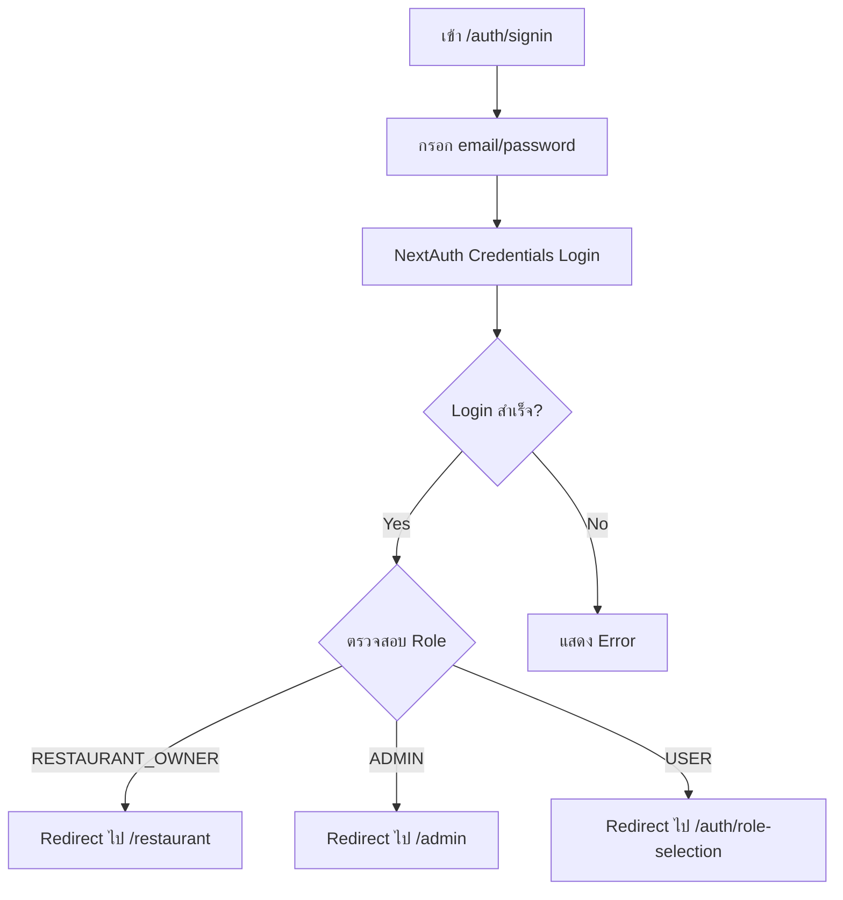
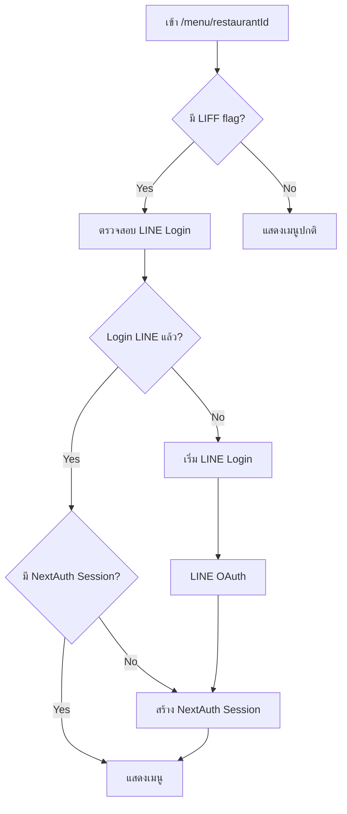

# ระบบ Authentication Summary

## 🔐 แบ่งประเภทการเข้าสู่ระบบตาม Role

### 1. 🏪 RESTAURANT_OWNER (เจ้าของร้าน)
- **เข้าสู่ระบบผ่าน**: `/auth/signin` (NextAuth Credentials)
- **หลังจาก login สำเร็จ**: redirect ไป `/restaurant`
- **ฟีเจอร์**:
  - จัดการข้อมูลร้าน
  - จัดการเมนูอาหาร
  - ตั้งค่า LINE LIFF
  - ดูออเดอร์
  - อัปโหลดรูปภาพ

### 2. 👑 ADMIN (ผู้ดูแลระบบ)
- **เข้าสู่ระบบผ่าน**: `/auth/signin` (NextAuth Credentials)
- **หลังจาก login สำเร็จ**: redirect ไป `/admin`
- **ฟีเจอร์**:
  - อนุมัติ/ปฏิเสธร้านอาหาร
  - จัดการผู้ใช้ทั้งหมด
  - ดูสถิติระบบ

### 3. 👤 CUSTOMER (ลูกค้า)
- **เข้าสู่ระบบผ่าน**: `/menu/[restaurantId]` (LINE LIFF Login)
- **หลังจาก login สำเร็จ**: อยู่ในหน้าเมนูเดิม
- **ฟีเจอร์**:
  - ดูเมนูอาหาร
  - สั่งอาหาร
  - ดูประวัติการสั่ง

---

## 🚀 การทำงานของระบบ

### Authentication Flow สำหรับ RESTAURANT_OWNER & ADMIN



### Authentication Flow สำหรับ CUSTOMER



---

## 📁 ไฟล์และ Component ที่เกี่ยวข้อง

### NextAuth Configuration
- `src/app/api/auth/[...nextauth]/route.ts` - การตั้งค่า NextAuth
- `src/app/auth/signin/page.tsx` - หน้า login สำหรับ RESTAURANT_OWNER & ADMIN

### LIFF Configuration  
- `src/components/LiffHandler.tsx` - จัดการ LINE LIFF login
- `src/app/menu/[restaurantId]/page.tsx` - หน้าเมนูที่รองรับ LIFF
- `src/app/liff/page.tsx` - หน้า landing สำหรับ LIFF

### API Routes
- `src/app/api/restaurant/default/route.ts` - หาร้าน default
- `src/app/api/restaurant/[restaurantId]/liff/route.ts` - จัดการ LIFF ID
- `src/app/api/liff/redirect/route.ts` - redirect LIFF ไปเมนู

### Middleware
- `src/middleware.ts` - ตรวจสอบ authentication และ routing

---

## 🔧 การตั้งค่าที่จำเป็น

### Environment Variables
```env
# NextAuth
NEXTAUTH_SECRET=your_secret_here
NEXTAUTH_URL=http://localhost:3000

# LINE Login
LINE_CLIENT_ID=your_line_client_id
LINE_CLIENT_SECRET=your_line_client_secret

# LINE LIFF
NEXT_PUBLIC_LIFF_ID=your_liff_id_here

# Database
DATABASE_URL=your_database_url
```

### LINE LIFF Setup
1. สร้าง LINE Login Channel
2. สร้าง LIFF App
3. ตั้งค่า Endpoint URL: `https://yourdomain.com/liff`
4. เพิ่ม LIFF ID ในระบบผ่าน `/restaurant/liff-setup`

---

## 🧪 การทดสอบ

### ทดสอบ RESTAURANT_OWNER Login
1. ไปที่ `http://localhost:3000/auth/signin`
2. Login ด้วย `ball_t1@hotmail.com` / `123456`
3. ควร redirect ไป `/restaurant`

### ทดสอบ CUSTOMER Login (LIFF)
1. เปิด LINE LIFF URL: `https://liff.line.me/{LIFF_ID}?restaurant={RESTAURANT_ID}`
2. หรือไปที่ `http://localhost:3000/menu/{RESTAURANT_ID}?liff=true`
3. ควรเริ่มต้น LINE login process
4. หลัง login สำเร็จ ควรอยู่ในหน้าเมนู

### ทดสอบ Navigation
- หน้า `/restaurant/*` - ต้อง login เป็น RESTAURANT_OWNER
- หน้า `/admin/*` - ต้อง login เป็น ADMIN  
- หน้า `/menu/*` - สามารถใช้ได้โดยไม่ login หรือ login ด้วย LINE

---

## 🚨 ข้อสำคัญ

1. **RESTAURANT_OWNER & ADMIN** ใช้ NextAuth Credentials เท่านั้น
2. **CUSTOMER** ใช้ LINE LIFF เท่านั้น (ในหน้าเมนู)
3. หน้าเมนูสามารถเข้าดูได้โดยไม่ login แต่ต้อง login เพื่อสั่งอาหาร
4. การ redirect หลัง login ขึ้นอยู่กับ role และหน้าที่เข้ามา
5. LIFF ทำงานเฉพาะในหน้า `/menu/*` และ `/cart/*` 